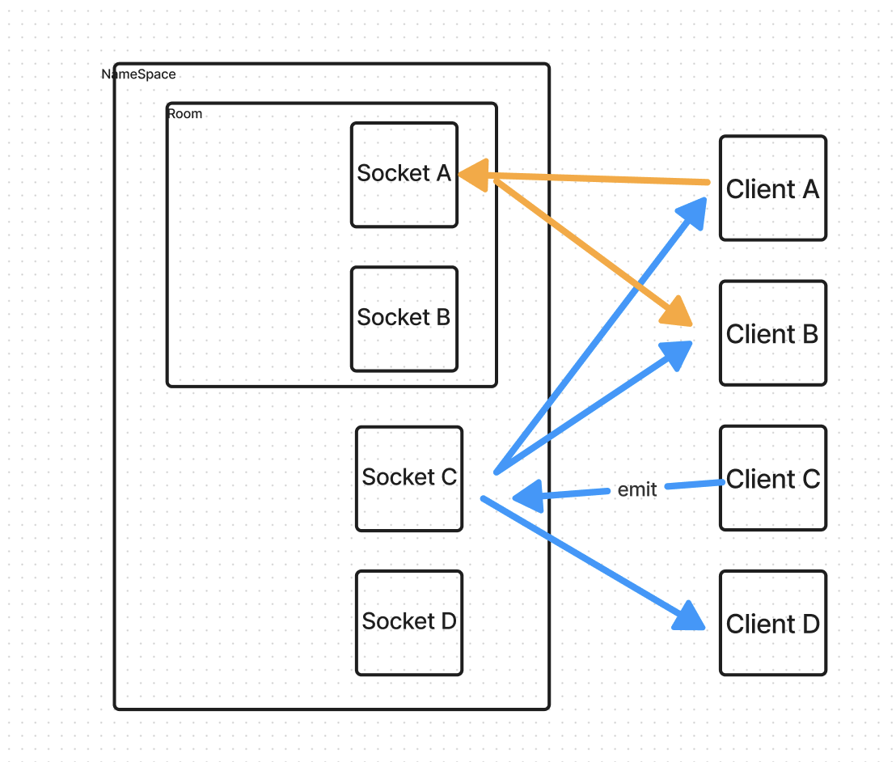

# quizMasterBackend

## Author: Francisco Sanchez and Kenya Womack

## Problem Domain

Our team set out on the task to build a backend quiz room style game. Utilizing socket.io and socket.io-client, we were able to establish a system that enters a select namespaces per user choice upon login, then provides the user with functionality to enter individual rooms for private messaging with someone else.

## Links and Resources

- [GitHub Actions ci/cd](https://github.com/c0d3cisco/quizMasterBackend/actions)

## Collaborators

ChatGPT was used to help overcome challenges when knowledge was limited on the posible application of JavaScript. Find code starting with `//ChatGPT helped` to see where it was used.

### Setup

#### How to initialize/run your application (where applicable)

1. Clone this repository to a location of your choosing. In the terminal, navigate to the directory and run the following commands:
2. `npm i` to install dependencies
3. Copy the `.env.example` file and rename it to `.env`
4. Make a copy of Client1 folder and its contents and rename the folder to Client2.
5. Within in Client 1 and Client 2 index.js file, update your username. 
6. Using three terminals in the repository, use `node server/index.js` in one, `node client1/index.js` in another, and `node client2/index.js` in the last one.

#### Command lines

 >'chrm' - - - - - - - - - - -  Kills script to change rooms.\
 >'x-- \<namespace>'  - - - - -  Namespaces: home, trivia, math to enter namespace after --\
 > 'socket' - - - - - - - - - -  Socket info after room selection server initiation. CAUTION: space after dash is crucial.\
    'm, \<message>' - - - - - - -  CHAT in after entering namespace.\
    'rm- \<roomName>' - - - - - -  RoomName of your choosing.\
    'mr, \<message>' - - - - - - -  CHAT in after entering namespace.\
    'lr' - - - - - - - - - - - -  Leave current room.\
    'hi' - - - - - - - - - - - -  Validation Test in namespace\
    'clear'  - - - - - - - - - -  Clears terminal`

#### UML

